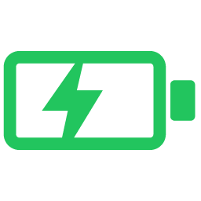
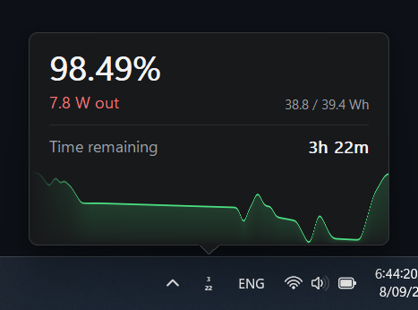
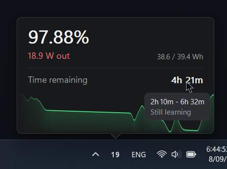
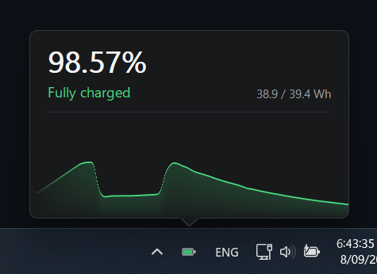
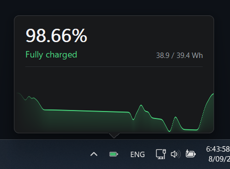
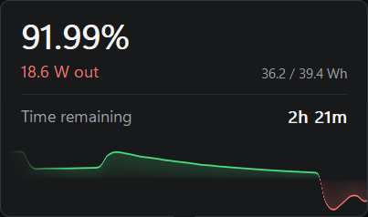
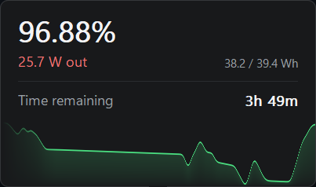
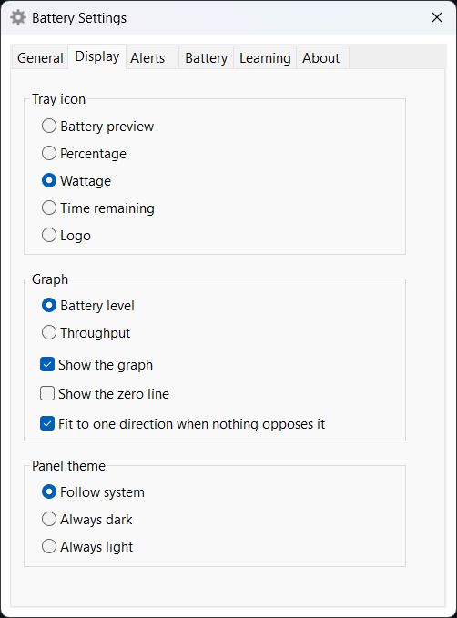
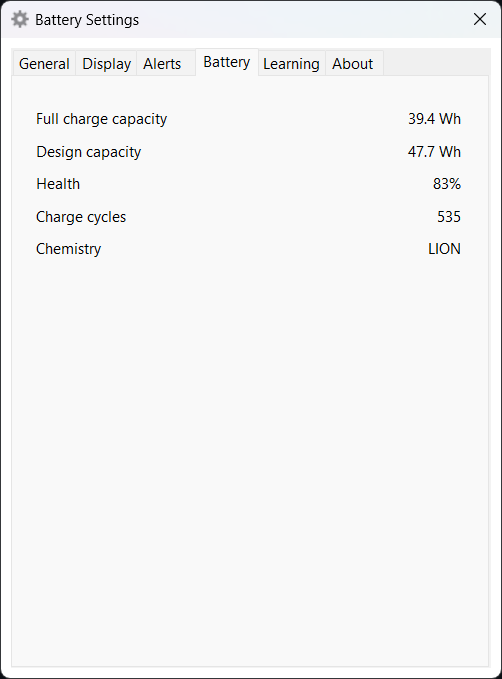
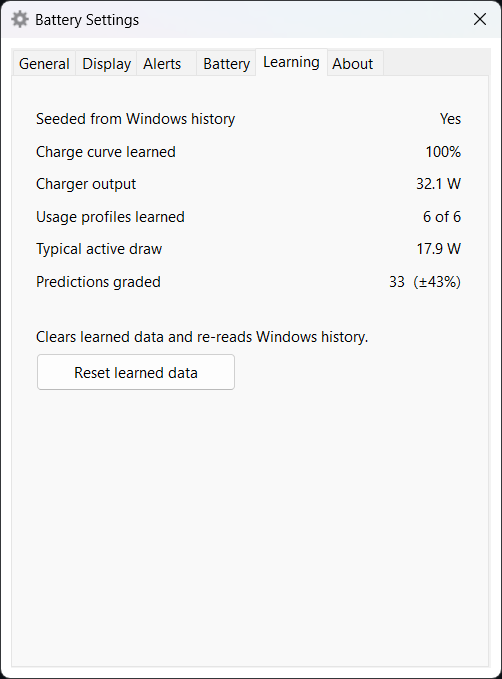

<div align="center">



# BatteryTray

**A lightweight Windows tray app that predicts how long your battery will actually last. Built in Rust, with no runtime and no installer.**

It reads the watts genuinely entering or leaving the battery rather than guessing from CPU usage, and it learns how *your* machine behaves — so the estimate gets better the longer you run it instead of being a nameplate figure divided by a guess. Time to empty, time to 80% while charging, time to full, a live graph of power or charge, and an honest confidence range on every prediction.

<br>

 &nbsp; 

</div>

## Features

- **Time to empty, to 80%, and to full** — one number at a time, whichever is the one that matters right now
- **Real watts in and out** — measured by the battery itself through the driver, never inferred from CPU load
- **A learned charge curve** — charging is not linear, so the taper is measured per device rather than assumed ([how it works](#how-it-learns-your-battery))
- **It says how sure it is** — hover the time row for an uncertainty range and a confidence word, both earned by grading its own past predictions
- **Live graph** — battery level or power throughput, scrolling continuously, coloured by direction: green in, red out
- **Battery health** — full-charge versus design capacity, cycle count, chemistry
- **Five tray icon styles** — battery preview, percentage, wattage, time remaining, or just the logo
- **Alerts** — low and critical charge, at 80%, and at full, each optional and edge-triggered so a battery resting on the threshold cannot spam you
- **Light and dark** — follows Windows, or pinned either way
- **Accurate on day one** — seeds itself from Windows' own battery report on first run, so it is not guessing while it learns
- **Minimal footprint** — ~2.5 MB of RAM, a rounding error of CPU, one ~530 KB executable

## Installation

Download the latest release from the [Release](https://github.com/Antoinenz/battery-tray/releases/latest) page and run it. There is nothing to install and nothing to configure.

| Platform | File |
|----------|------|
| Windows (x64) | `battery-tray.exe` — standalone, no installer |

Developed and tested on Windows 11. Turn on **Start with Windows** in Settings if you want it back after a reboot. To uninstall, quit it and delete the exe; its settings and learned data live in `%LOCALAPPDATA%\BatteryTray`, which you can delete too.

## Using it

| Action | Result |
|--------|--------|
| **Left-click** the tray icon | Open the panel — click again to close |
| **Right-click** it | Settings and Quit |
| **Hover** the time row | Uncertainty range and confidence |
| **Click** the graph | Switch between battery level and throughput |

The panel closes when you click anything else, unless you pin it in Settings — pinned, it stays until dismissed and can be dragged anywhere on screen.

## How it learns your battery

Most battery estimates are `charge remaining ÷ current draw`. That is wrong in both directions, and this app avoids it in two different ways.

**Discharging**, the draw you are pulling right now is a poor guide to the next three hours, because you will not keep doing what you are doing. Expected draw is blended across three horizons — this instant, the last hour, and how this machine normally behaves in this context — and the time remaining is solved by integrating that forward, not by dividing.

**Charging** is the more interesting half, because charging is not linear. A lithium cell charges at constant current until it approaches full, then switches to constant voltage, and the power going in collapses. The last 20% can take as long as the first 60%. Any predictor assuming a steady rate will promise you a full battery long before you get one.

So the app learns your charger and your cell as two separate things:

| | What it is | What it says |
|---|---|---|
| **Shape** | 20 buckets of 5% charge, each holding the rate at that level as a fraction of the peak | How your taper falls away |
| **Peak** | What your charger actually delivers, in watts | How fast |

Keeping them apart is what makes swapping chargers safe: plug in a weaker one and only the peak moves, while the shape — the physics of the cell — stays put. Averaging two chargers into one curve would corrupt both. The textbook says the taper begins at 80%; on the machine this was built on it begins nearer 60%, which is exactly why it is measured rather than assumed.

The peak is tracked as an **80th percentile** rather than an average, because charge data is full of trickle and nearly-full periods — a mean over them read 17 W against a real 27 W charger.

Finally, **it marks its own work.** Every prediction is filed with its target; when the target arrives, the real elapsed time is recorded against it. The running median of actual-versus-predicted becomes a correction applied to future estimates, and how widely those grades scatter becomes the confidence you see on hover. That is why a fresh install says "Still learning" and an old one does not.

See [docs/prediction.md](docs/prediction.md) for the two-track rate estimation, charge-limit detection, and measured accuracy against a naive baseline.

## Development

**Prerequisites:** Rust (stable). The Windows SDK's `rc.exe` is used to embed the icon and version block if present, but the build succeeds without it.

```bash
# Build
cargo build --release

# Test
cargo test --workspace

# Run with tracing
BATTERY_TRAY_LOG=1 ./target/release/battery-tray.exe
```

Three crates: `battery-core` is pure Rust and holds the estimator, the charge curve, persistence and the tests; `battery-win` wraps the battery IOCTLs; `battery-tray` is the Win32 layer — tray icon, panel, settings, message loop. No WMI, no COM, no runtime.

See [docs/development.md](docs/development.md) for architecture, the replay harness, files on disk and cutting a release, and [docs/drawing.md](docs/drawing.md) for how the panel and graph are rendered.

## Screenshots

<details>
<summary>More screenshots</summary>
<br>

 &nbsp; 

 &nbsp; 

 &nbsp; 



(Screenshots taken of version 0.1.1 on Windows 11)
</details>

## License

[MIT](https://github.com/Antoinenz/battery-tray?tab=MIT-1-ov-file)
